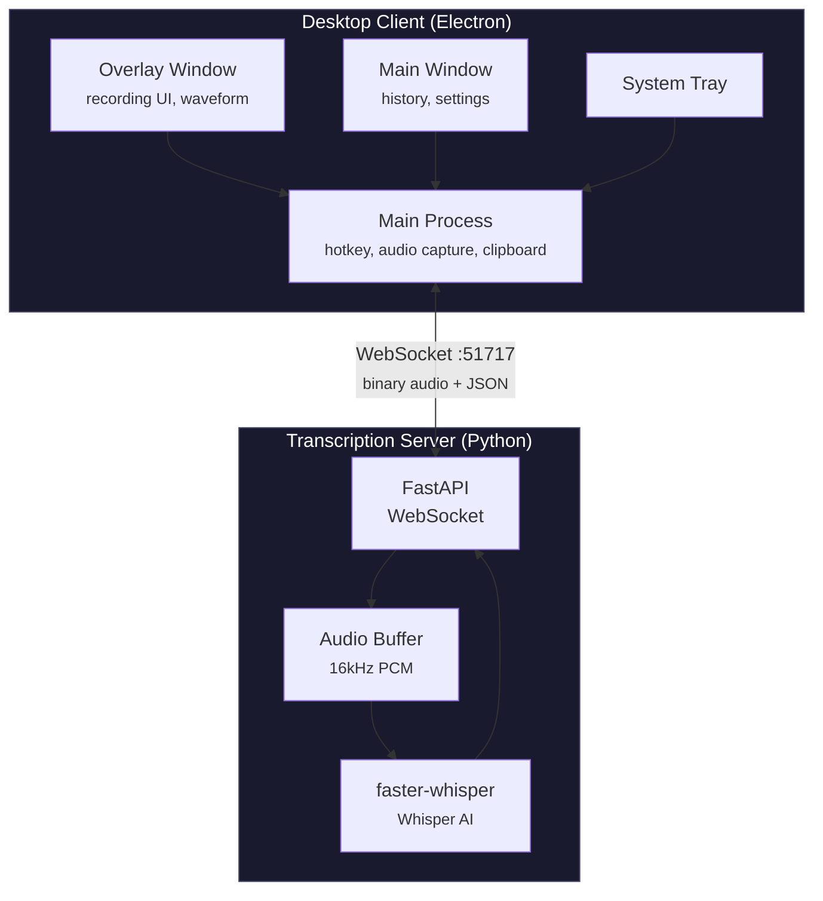
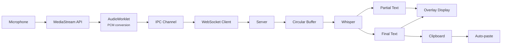
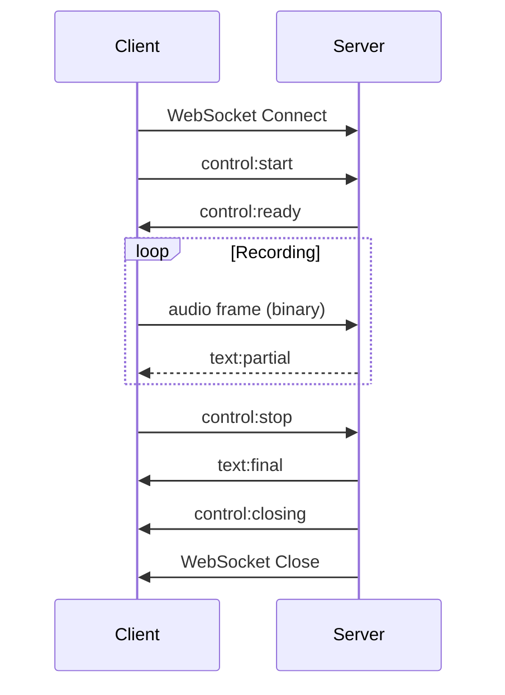

<p align="center">
  
</p>

<h1 align="center">Murmur</h1>

<p align="center">
  <strong>Local voice transcription for Windows</strong>
</p>

<p align="center">
  Press a key, speak, release. Your words appear wherever you're typing.
</p>

<p align="center">
  
  
  
  
</p>

---

> [!CAUTION]
> **Murmur is in early development.** The core transcription pipeline works, but the user experience is still evolving. Expect rough edges and breaking changes between versions.

## What is Murmur?

Murmur is a desktop voice transcription app that runs entirely on your machine. Hold down a hotkey, speak naturally, and your transcribed text is automatically typed into whatever application has focus. No cloud services, no subscriptions, no data leaving your computer.

The app consists of two components: an **Electron desktop client** with a minimal always-on-top overlay, and a **local Python server** powered by [faster-whisper](https://github.com/SYSTRAN/faster-whisper) (OpenAI's Whisper model optimized for speed).

## Features

> [!NOTE]
> Features marked with :construction: are partially implemented or under development.

| Feature | Status | Description |
|---------|--------|-------------|
| Hold-to-talk | :white_check_mark: | Press and hold hotkey to record, release to transcribe |
| Real-time feedback | :white_check_mark: | See partial transcription as you speak |
| Minimal overlay | :white_check_mark: | Non-intrusive pill with animated waveform |
| Auto-paste | :white_check_mark: | Transcribed text typed into active window |
| Transcription history | :white_check_mark: | Searchable, filterable local history |
| Runs locally | :white_check_mark: | All processing on your machine (GPU/CPU) |
| Configurable hotkey | :construction: | Currently hardcoded to F17 |
| Toggle mode | :construction: | Click to start/stop (vs hold-to-talk) |
| Text post-processing | :construction: | Filler word removal, punctuation |

## Architecture



<details>
<summary><strong>Audio Pipeline Details</strong></summary>



</details>

## Tech Stack

| Component | Technologies |
|-----------|--------------|
| **Desktop App** | Electron, Svelte 5, TypeScript, Tailwind CSS v4 |
| **Server** | Python 3.11+, FastAPI, faster-whisper, uvicorn |
| **Database** | SQLite (better-sqlite3) for history |
| **Audio** | Web Audio API, AudioWorklet, 16-bit PCM @ 16kHz |

## Getting Started

### Prerequisites

- **Windows 10/11** (the Electron app currently targets Windows only)
- **Node.js 18+** and **Bun** (for the desktop app)
- **Python 3.11+** and **uv** (for the server)
- **CUDA-capable GPU** (recommended) or CPU for transcription

### Installation

<details>
<summary><strong>1. Clone the repository</strong></summary>

```bash
git clone https://github.com/yourusername/murmur.git
cd murmur
```

</details>

<details>
<summary><strong>2. Set up the transcription server</strong></summary>

```bash
cd server

# Install dependencies with uv
uv sync

# Start the server
just start
# Or in background: just start-bg
```

> [!TIP]
> The server will download the Whisper model on first run (~1.5GB for the default model). This only happens once.

</details>

<details>
<summary><strong>3. Set up the desktop app</strong></summary>

From PowerShell on Windows:

```powershell
cd app

# Install dependencies
bun install

# Run in development mode
bun run dev
```

</details>

### Usage

1. Start the transcription server (`just start` in the server directory)
2. Launch the Murmur app
3. Press and hold **F17** to record
4. Speak naturally
5. Release the key — your text appears in the active window

> [!TIP]
> The app lives in your system tray. Click the tray icon to access settings and history.

## Protocol

Murmur uses a custom WebSocket protocol for efficient audio streaming and transcription.



<details>
<summary><strong>Protocol Features</strong></summary>

- **Binary audio frames** — 5-byte header (sequence, sample count, flags) + PCM data
- **JSON control frames** — Session management (start, stop, ready, error)
- **Text frames** — Partial and final transcription results with confidence scores
- **Silence detection** — Automatic session ending after configurable timeout

</details>

See the full [Protocol Specification](docs/protocol.md) for details.

## Configuration

### Server Environment Variables

All server settings can be configured via environment variables prefixed with `MURMUR_`.

| Variable | Default | Description |
|----------|---------|-------------|
| `MURMUR_HOST` | `0.0.0.0` | Server bind address |
| `MURMUR_PORT` | `51717` | Server port |
| `MURMUR_MAX_SESSIONS` | `10` | Maximum concurrent sessions |
| `MURMUR_START_TIMEOUT` | `10.0` | Seconds to wait for start frame |
| `MURMUR_WHISPER_MODEL` | `large-v3-turbo` | Whisper model to use |
| `MURMUR_WHISPER_DEVICE` | `auto` | Device: `auto`, `cpu`, or `cuda` |
| `MURMUR_WHISPER_COMPUTE_TYPE` | `auto` | Compute type: `auto`, `int8`, `float16`, etc. |
| `MURMUR_PARTIAL_EMISSION_INTERVAL` | `0.2` | Minimum seconds between partial transcription updates |
| `MURMUR_MIN_AUDIO_FOR_TRANSCRIPTION` | `0.5` | Minimum audio (seconds) before transcribing |
| `MURMUR_LOG_LEVEL` | `INFO` | Log level: `DEBUG`, `INFO`, `WARNING`, `ERROR` |
| `MURMUR_LOG_BINARY` | `false` | Enable verbose binary frame logging (very spammy) |

<details>
<summary><strong>Example: Running with debug logging</strong></summary>

```powershell
# PowerShell
$env:MURMUR_LOG_LEVEL="DEBUG"; uv run murmur

# Also enable binary frame logging (very verbose)
$env:MURMUR_LOG_LEVEL="DEBUG"; $env:MURMUR_LOG_BINARY="true"; uv run murmur
```

</details>

### App Settings

App settings are configured through the Settings UI (accessible from the system tray). Settings include:

- **Hotkey** — Keyboard shortcut to trigger recording
- **Activation Mode** — Hold-to-talk or toggle
- **Input Device** — Microphone selection
- **Auto-copy/Auto-paste** — Clipboard behavior
- **Update Speed** — How often partial transcriptions update (100-500ms)
- **Server URL** — WebSocket endpoint for the transcription server

## Building

See [BUILDING.md](BUILDING.md) for the full development setup, production packaging, and troubleshooting guide.

## Contributing

Contributions are welcome. Please open an issue first to discuss what you'd like to change.

## License

[MIT](LICENSE)

---

<p align="center">
  <sub>Built with Electron, Svelte, FastAPI, and FasterWhisper</sub>
</p>
