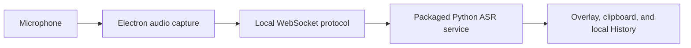

# Eve for Windows

Local dictation for Windows, built as an Electron desktop client with a packaged Python transcription service.


> [!IMPORTANT]
> Current source builds use the visible **Eve** product, executable, installer, and shortcut names, the `io.github.burntcookiedough.eve` AppUserModelID, and a separate `%APPDATA%\Eve` profile. The published v0.6.3 download remains **Murmur** and is listed below unchanged. The frozen installer GUID, internal `murmur` package name, compatibility payload name, and `MURMUR_*` interfaces remain stable for upgrade compatibility. Eve does not import or delete Murmur History, settings, or other personal state.

## What works today

- Global hotkeys for Fast and Long Dictation
- A click-through recording overlay with microphone levels and partial text
- Local transcription through faster-whisper or Nemotron
- Automatic clipboard copy and paste, with optional clipboard restoration
- Searchable local History and aggregate Insights
- Packaged server lifecycle controls and privacy-bounded diagnostics
- CPU fallback and CUDA diagnostics for supported NVIDIA systems

The desktop client sends 16 kHz mono PCM audio through its main process to the packaged Python service over a WebSocket on the same machine. The service returns partial and final text, and History is stored in a local SQLite database.



Models are not embedded in the installer payload. The selected engine downloads its model from Hugging Face on first use. The optional external-server mode changes the data boundary: audio is sent to the server URL configured by the user rather than the packaged local service.

## Current release

[Download v0.6.3](https://github.com/burntcookiedough/eve-windows-dictation/releases/tag/v0.6.3). The release is currently unsigned and may trigger Windows reputation warnings.

| Asset | Bytes | SHA-256 |
|---|---:|---|
| `Murmur.Web.Setup.0.6.3.exe` | 887,561 | `366088a4266f54ea7c39e2e7fd1fc7177cac46bf8a4b3f43d58a6d025e15cd33` |
| `murmur-0.6.3-x64.nsis.7z` | 2,034,188,308 | `0b557fde05853da1f7c0aef77cecbad1faf8c5fc9314457ea45119d3a69f4fbd` |
| `latest.yml` | 564 | `b211cdb0322a0f6da01eee77921f6c6961735de59d4ffd8cacc31d9a3f7395a9` |

The small `nsis-web` installer downloads the large application payload during installation. Internet access is also required when an engine fetches its model for the first time.

## Engineering record

This repository preserves the original commit authorship and the later work that made the Windows release path dependable. The work added through v0.6.3 includes:

- portable Python discovery and packaged-runtime validation;
- constrained release publication and corrected NSIS-web download targeting;
- visible model-download progress and estimated time remaining;
- broken-pipe containment, protocol-readiness gating, and stale microphone-start cancellation;
- privacy-bounded diagnostics and History layout corrections;
- repeatable release checks with exact artifact sizes and digests.

The [v0.6.3 engineering case study](docs/engineering/v0.6.3-release-case-study.md) maps these claims to pull requests, commits, tests, and release artifacts. Planned component downloads and new ASR profiles are documented in the [roadmap](ROADMAP.md) as research, not shipped functionality.

## Development

Development and packaging target Windows. If the repository is opened from WSL, run Bun, uv, Python, pytest, and packaging commands through Windows PowerShell so platform-specific environments are not replaced with Linux binaries.

```powershell
# Server
cd server
uv sync --extra whisper --group dev
uv run pytest

# Desktop app, in a separate PowerShell session
cd app
bun install
bun run dev
```

Use `uv sync --extra all` when preparing a release runtime with both shipped engines. See [BUILDING.md](BUILDING.md) for release and packaging details, [docs/protocol.md](docs/protocol.md) for the WebSocket protocol, and [CONTRIBUTING.md](CONTRIBUTING.md) before opening a pull request.

## Privacy and support

The default packaged path keeps captured audio and transcription on the local machine. Network access is used to download the installer payload and first-use model files. External-server mode is an explicit exception to local processing. See [PRIVACY.md](PRIVACY.md) for the data boundaries and [SUPPORT.md](SUPPORT.md) for support expectations.

Security reports should follow [SECURITY.md](SECURITY.md) and should never include private audio, transcript text, clipboard contents, access tokens, or unredacted local paths.

## License and provenance

The source is available under the [MIT License](LICENSE). Eve contains software derived from the MIT-licensed Murmur project. Original copyright notices and commit authorship are preserved; later implementation and release-hardening work is identified separately. See [NOTICE.md](NOTICE.md).
