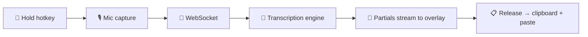

<p align="center">
  
</p>

<h1 align="center">Murmur</h1>

<p align="center">
  Local voice-to-text for Windows. Hold a key, talk, let go — your words land wherever you're typing.
</p>

<p align="center">
  
</p>

<!-- TODO: add a demo gif here once one exists -->

---

Everything runs on your machine. No cloud, no account, no sending audio anywhere. Murmur sits in your system tray and gives you a global hotkey that turns speech into text in any app — your editor, your browser, a chat window, whatever has focus.

## How It Works



Audio flows from your mic through an [AudioWorklet](https://developer.mozilla.org/en-US/docs/Web/API/AudioWorklet), gets sent as 16-bit PCM over a local WebSocket, and hits the transcription engine running on your GPU (or CPU). Partials stream back in real-time so you see words forming as you speak. When you release the key, the final transcription lands in your clipboard and gets pasted automatically.

The overlay is a transparent, always-on-top, click-through window — it shows up when you're recording and gets out of the way when you're not.

- Windows 10/11
- Bun
- Python 3.11+
- uv
- just
- CUDA-capable GPU recommended (driver 525+; CPU is supported but slower)

- **Hold-to-talk or toggle mode** — bind any key as your global hotkey
- **Transparent overlay** — live waveform and partial transcription while you speak
- **Two engines, hot-swappable** — switch between them without restarting
- **Auto-paste** — transcribed text goes straight to your clipboard and into the active field
- **Post-processing** — auto-append periods, spaces, or both
- **Searchable history** — every transcription saved locally in SQLite
- **In-app server controls** — start, stop, restart, stream logs, all from the settings panel
- **External server mode** — point Murmur at a remote server if you want

## Engines

Murmur ships with two transcription engines. Both run locally and can be swapped at runtime from the settings panel.

| | Nemotron | Whisper |
|---|---|---|
| **Model** | `nvidia/nemotron-speech-streaming-en-0.6b` | `large-v3-turbo` (via faster-whisper) |
| **Best for** | English dictation, low latency | Multilingual, accuracy |
| **Streaming** | Native streaming architecture | Chunked re-transcription |
| **Extras** | — | Hotword boosting |
| **VRAM** | ~1.5 GB | ~3 GB |

Nemotron is the default. It's a 0.6B parameter model built for streaming — partials come back fast and the final result is usually identical to the last partial. Whisper is the fallback for non-English languages or when you need hotword support to nail domain-specific terms.

## Quick Start

You need Windows 10/11 with [Bun](https://bun.sh), [Python 3.11+](https://python.org), [uv](https://docs.astral.sh/uv/), and [just](https://github.com/casey/just). A CUDA GPU is recommended but not required.

```powershell
# Server
cd server
uv sync --extra all    # or: --extra nemotron / --extra whisper
just start

# App (separate terminal)
cd app
bun install
bun run dev
```

The app auto-detects a running server in dev mode. In production, it manages the server lifecycle itself.

> [!NOTE]
> If you develop from WSL, run all `uv`/`bun`/`just` commands through PowerShell — not Linux. Running them from WSL replaces Windows binaries with Linux ones and breaks everything. See [BUILDING.md](BUILDING.md).

## Build

```powershell
cd server && uv sync --extra all
..\scripts\prepare-python-runtime.ps1 -ServerDir .
cd ../app && bun run package:win
```

`bun run package:win` produces a small nsis-web installer stub plus payloads (for example `.7z`, `.yml`, `.blockmap`) in `app/release/`. End users need internet to install (payload download) and to fetch models on first run.

Root-level helper:

```bash
just build
```

See `BUILDING.md` for full release and troubleshooting details.

For the exact Windows 11 + RTX 3060 local CUDA dictation setup, including model cache paths, settings JSON, verification commands, and expected latency/VRAM numbers, see **[docs/windows-local-cuda-dictation.md](docs/windows-local-cuda-dictation.md)**.

## Configuration

App settings (hotkey, audio device, engine, post-processing, auto-paste) are configured through the UI.

Server settings use `MURMUR_`-prefixed environment variables and can also be changed at runtime from the app. Packaged builds persist them under the Electron user-data directory so upgrades do not overwrite them.

<details>
<summary><strong>Server environment variables</strong></summary>

| Variable | Default | Description |
|---|---|---|
| `MURMUR_HOST` | `0.0.0.0` | Bind host |
| `MURMUR_PORT` | `51717` | Bind port |
| `MURMUR_ENGINE` | `nemotron` | Default engine (`nemotron` / `whisper`) |
| `MURMUR_NEMOTRON_MODEL` | `nvidia/nemotron-speech-streaming-en-0.6b` | Nemotron model |
| `MURMUR_NEMOTRON_DEVICE` | `auto` | Device (`auto`/`cuda`/`cpu`) |
| `MURMUR_WHISPER_MODEL` | `large-v3-turbo` | Whisper model |
| `MURMUR_WHISPER_DEVICE` | `auto` | Device (`auto`/`cuda`/`cpu`) |
| `MURMUR_WHISPER_COMPUTE_TYPE` | `auto` | Whisper precision mode |
| `MURMUR_MAX_SESSIONS` | `10` | Concurrent session cap |
| `MURMUR_LOG_LEVEL` | `INFO` | `DEBUG`/`INFO`/`WARNING`/`ERROR` |

</details>

## Project Structure

```
app/      Electron desktop app (Svelte 5, TypeScript, Tailwind v4)
server/   Transcription server (FastAPI, faster-whisper, NeMo)
docs/     Protocol spec and technical docs
```

## Protocol

The app and server communicate over a custom WebSocket protocol on port 51717 — binary frames for audio, JSON frames for control and text. Full spec: **[docs/protocol.md](docs/protocol.md)**

## License

[MIT](LICENSE)
