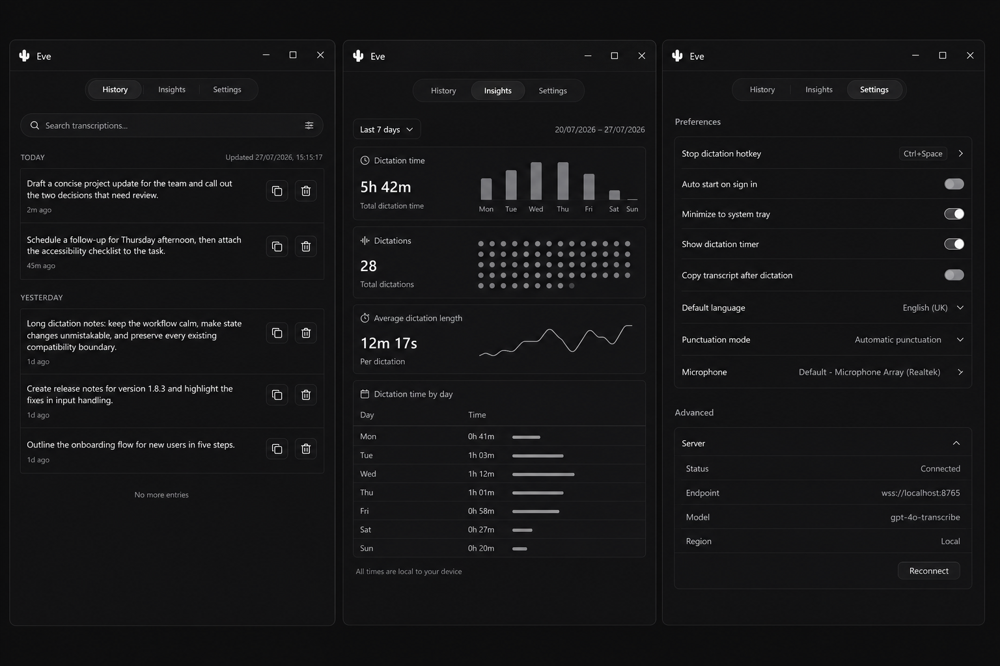
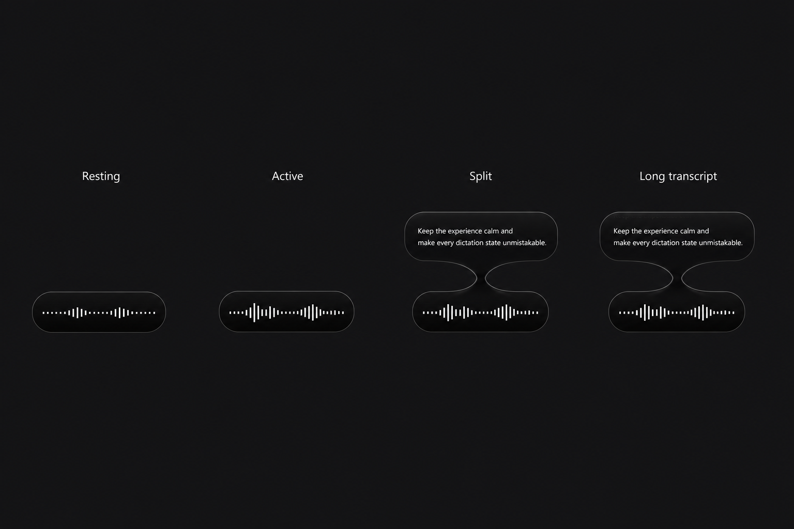

# Eve Gate 5 master plan

- Status: Gate 5A authorized; Gate 5B planned and separately gated
- Canonical base: `20a781f78d638bc5884a8e85511cf3c8507eca4b`
- Gate 4 accepted head contained by the base: `e2086fd8f36020ced09483311dde0530d6b8fe77`
- Repository: `burntcookiedough/eve-windows-dictation`
Last updated: 2026-07-27 (Asia/Calcutta)

## Purpose and user outcome

Gate 5 creates a coherent, accessible Eve desktop visual identity without changing the
compatibility, data, installer, startup, runtime, engine, or release architecture proven
in Gates 1–4.

The intended outcome is a calm, trustworthy Windows dictation experience with:

- a compact monochrome application shell;
- production navigation limited to History, Insights, and Settings;
- existing Server controls grouped under Settings > Advanced;
- a noninteractive, mouse-through waveform and transcript overlay with a fixed footprint;
- clear keyboard, focus, contrast, reflow, reduced-motion, reduced-transparency, and
  Windows High Contrast behavior in the main application; and
- a later, separately gated cactus resource family for packaged Windows identity.

## Decision ledger

| Decision | Status | Evidence or rationale |
|---|---|---|
| Use the two tracked reference images below as the only visual references | Approved | User selected them on 2026-07-27 and said “I like these only.” |
| Preserve current Eve product behavior and treat mock copy as placeholder content | Approved | Prevents ImageGen examples from creating settings, analytics, endpoints, models, or workflows. |
| Production IA is History / Insights / Settings | Approved | Removes non-customer Lab and top-level Server from production navigation. |
| Lab remains source-preserved and development-only | Approved | Keeps experimental work available without exposing it in production. |
| Existing Server behavior moves under Settings > Advanced | Approved | IA change only; IPC, state, operations, and runtime remain authoritative. |
| Overlay remains click-through and non-focusable | Approved | Gate 5A does not change runtime or input architecture. |
| Transcript uses a fixed two-line viewport with programmatic newest-text auto-follow | Approved | Manual scrolling is impossible and misleading in a mouse-through window. |
| Functional pause/resume and interactive overlay controls are deferred | Approved | They require a separate runtime/input architecture phase. |
| Split Gate 5 into 5A and 5B | Approved | Renderer/accessibility work can be reviewed without packaging; resource work receives its own Windows lifecycle. |
| Package exactly once, only for final Gate 5B | Approved | Gate 5A changes no packaged resources and needs no installer lifecycle. |
| No Gate 5 merge, package, release, tag, or publication without its stated approval | Frozen | Maintains explicit external-state control. |

## Canonical visual references

### Application board

- File: `docs/architecture/assets/eve-gate-5-application-reference.png`
- SHA-256: `37A983FA4BA295347E4FEBB28DAB428570DFB997E27209A002BBF7E74806DC4C`
- Provenance: user-selected on 2026-07-27 from the Gate 5 planning session.
- Privacy: synthetic interface content; no personal data.
- Meaning: final visual direction for History, Insights, and Settings, with Server under
  Settings > Advanced.

### Overlay board

- File: `docs/architecture/assets/eve-gate-5-overlay-reference.png`
- SHA-256: `60CC848D4837BB83307C9F750D1DD3D9F6D83B364707780A363E86D971EDF742`
- Provenance: user-selected on 2026-07-27 from the Gate 5 planning session.
- Privacy: synthetic interface content; no personal data.
- Meaning: final visual direction for Resting, Active, Split, and Long transcript.

These exact bytes must not be regenerated, substituted, cropped, overwritten, or treated
as production assets. Reference text, metrics, model names, endpoints, timestamps, and
values are visual placeholders only. Existing Eve data, settings, IPC, and runtime
contracts are authoritative.

## Interpretation rules and numeric visual specification

The references establish composition, density, hierarchy, visual rhythm, transparency,
monochrome treatment, and motion intent. The measurable specification below resolves
ImageGen irregularities and is authoritative for implementation geometry.

| Property | Gate 5 specification |
|---|---|
| Typeface | `Segoe UI Variable`, `Segoe UI`, system sans-serif |
| Type scale | 12/16, 13/18, 14/20, 16/24, 20/28, and 28/34 CSS px |
| Spacing scale | 4, 8, 12, 16, 24, and 32 CSS px |
| Compact control radius | 6 px |
| Row and field radius | 10 px |
| Section radius | 14 px |
| Navigation and waveform radius | Fully rounded |
| Base surface | `#08090A` |
| Raised surface | White at 3.5% opacity |
| Selected surface | White at 6% opacity |
| Hover surface | White at 9% opacity |
| Divider | White at 10% opacity |
| Hover divider | White at 16% opacity |
| Reduced-transparency fallback | Solid `#111214` and `#18191B` |
| Focus indicator | 2 px near-white ring, 2 px offset, at least 3:1 local contrast |
| Control motion | 120 ms |
| Navigation motion | 180 ms |
| Overlay split motion | 220 ms |
| Easing | `cubic-bezier(0.2, 0.8, 0.2, 1)` |
| Reduced motion | Immediate state change; no positional split animation |
| Main window default | Existing 600 x 900 CSS px |
| Main window minimum | Existing 400 x 600 CSS px |
| Waveform capsule | 150 x 50 CSS px; 3:1 aspect ratio |
| Transcript capsule | Quick at most 360 x 64 px; Long at most 480 x 64 px |
| Settled vertical gap | 12 px where the state is visually separated |
| Transcript viewport | Exactly two lines, fixed height, newest content auto-followed |
| Overlay host window | Existing quick/long widths and 320 px transparent height |
| External effects | No glow, halo, colored shadow, radiating light, or flashing |

The application should use spacing, typography, alignment, and subtle row separators
before adding tinted surfaces. It must not reproduce mock artifacts literally or add
unsupported product content merely because it appears in a reference.

## Frozen Gates 1–4 boundaries

Gate 5 must preserve all of the following exactly:

- AppUserModelID and Electron Builder app ID:
  `io.github.burntcookiedough.eve`;
- NSIS GUID: `0204d005-75b3-5b31-b1f6-ef2831e2b204`;
- version: `0.6.3`;
- the published Murmur install/upgrade/uninstall chain;
- `%APPDATA%\Eve` as Eve's isolated profile and `%APPDATA%\murmur` as an untouched
  inactive legacy profile;
- startup/login policy and exact known-entry handling;
- shared Hugging Face model-cache behavior;
- protocols, IPC contracts, `window.murmurMain`, `window.murmur`, and `MURMUR_*`;
- updater, release repository, artifact compatibility, and historical release assets;
- Python/runtime/engine behavior and dependencies; and
- all internal compatibility names not explicitly owned by this visual phase.

Neither profile may be inspected, migrated, merged, renamed, exposed, or deleted. Gate 5
must not read personal History, settings, hotwords, browser state, credentials, logs,
audio, transcripts, or unknown startup values. It must not move or delete shared model
files.

## Gate 5A — renderer, information architecture, overlay, and accessibility

### Scope

- Apply the approved monochrome visual system to the existing Svelte renderer.
- Expose History, Insights, and Settings in production navigation.
- Preserve Lab source and expose it only when `import.meta.env.DEV` is true.
- Remove top-level Server navigation and embed every existing Server operation under
  Settings > Advanced.
- Preserve current settings, analytics, data sources, IPC calls, server operations, and
  error behavior.
- Implement the approved noninteractive overlay states without adding runtime commands.
- Correct semantic structure, keyboard behavior, focus visibility, dialog focus
  containment/return, target sizing, contrast, reflow, forced-colors, reduced motion,
  and reduced transparency.
- Preserve Windows title-bar dragging and native window operations, including Snap.

### Non-goals

- cactus production resources or packaged icon changes;
- package, installer, repair, uninstall, or rollback execution;
- pause/resume, retry, end, hover, focus, or manual scrolling controls in the overlay;
- new settings, analytics, models, endpoints, routes, deep links, protocols, IPC,
  runtime, engine, dependency, or server behavior;
- profile, startup, updater, version, release, homepage, legal, signing, or publication
  work; and
- deletion or cleanup of TestView, Server code, or internal compatibility names.

### Production and development IA

- Production tabs are exactly History, Insights, and Settings.
- Development tabs add Lab as a fourth item.
- Server is never a top-level tab.
- Existing Server status, start/stop/restart, auto-start, engine configuration, external
  server configuration, and logs remain available under Settings > Advanced.
- Eve has no supported renderer route or external view deep link. Gate 5A creates none.
- Renderer reload continues to start on History.
- Any unrecognized internal view value resolves to History.

### Exact Gate 5A file ceiling

Gate 5A may change at most these 28 tracked files. A 29th file requires explicit scope
review before it is changed.

| # | File | Requirement and evidence |
|---:|---|---|
| 1 | `docs/architecture/eve-gate-5-master-plan.md` | Durable whole-program contract and stage ledger. |
| 2 | `docs/architecture/assets/eve-gate-5-application-reference.png` | Exact approved application reference and verified hash. |
| 3 | `docs/architecture/assets/eve-gate-5-overlay-reference.png` | Exact approved overlay reference and verified hash. |
| 4 | `app/src/shared/constants.ts` | Measured main/overlay geometry; overlay-position tests. |
| 5 | `app/src/main/windows/main.ts` | Windows title-bar/Snap-compatible shell; manual Windows matrix. |
| 6 | `app/src/main/windows/overlay.ts` | Preserve click-through and non-focusable behavior; focused guard. |
| 7 | `app/src/renderer/app/App.svelte` | Production/dev IA and invalid-view fallback; IA tests. |
| 8 | `app/src/renderer/app/app.css` | Tokens and forced-colors/transparency/motion fallbacks; contrast audit. |
| 9 | `app/src/renderer/app/components/TitleBar.svelte` | Drag/no-drag and native-caption accommodation; Windows smoke. |
| 10 | `app/src/renderer/app/components/HotkeyCaptureModal.svelte` | Focus trap, Escape, and focus return; keyboard/Narrator smoke. |
| 11 | `app/src/renderer/app/components/SettingsRow.svelte` | Semantic labels/descriptions and reflow; accessibility checks. |
| 12 | `app/src/renderer/app/components/SettingsSection.svelte` | Semantic section structure; UI Automation smoke. |
| 13 | `app/src/renderer/app/components/Toggle.svelte` | Name, role, checked and disabled states; keyboard/Narrator smoke. |
| 14 | `app/src/renderer/app/views/HistoryView.svelte` | Compact ledger, long text, independent row actions; state matrix. |
| 15 | `app/src/renderer/app/views/InsightsView.svelte` | Directly labelled monochrome analytics; non-color checks. |
| 16 | `app/src/renderer/app/views/SettingsView.svelte` | Existing settings plus Advanced Server; regression matrix. |
| 17 | `app/src/renderer/app/views/ServerView.svelte` | Embedded presentation with unchanged operations/IPC; server tests. |
| 18 | `app/src/renderer/overlay/App.svelte` | Resting/Active/Split/Long state composition; deterministic capture. |
| 19 | `app/src/renderer/overlay/app.css` | Approved motion and fallbacks; reduced-mode checks. |
| 20 | `app/src/renderer/overlay/components/Pill.svelte` | Fixed waveform geometry and no glow; visual comparison. |
| 21 | `app/src/renderer/overlay/components/TextDisplay.svelte` | Fixed two-line viewport and auto-follow; long-text guard. |
| 22 | `app/src/renderer/overlay/components/Waveform.svelte` | Monochrome, non-flashing waveform states; state comparison. |
| 23 | `app/tests/renderer-visual-guards.test.ts` | Visual token, overflow, no-glow, and no-control guards. |
| 24 | `app/tests/overlay-position.test.ts` | Geometry across display/work-area bounds. |
| 25 | `app/tests/gate5-information-architecture.test.ts` | Production/dev IA, invalid fallback, and Server wiring regression. |
| 26 | `app/tests/gate5-accessibility.test.ts` | Semantic, focus, forced-color, and overlay accessibility guards. |
| 27 | `docs/architecture/eve-gate-5a-evidence.md` | Factual validation, review, and handoff evidence. |
| 28 | `design-qa.md` | Same-viewport/state comparison; final result passed or blocked. |

The ceiling is an allowlist, not a requirement to modify every file.

### Implementation sequence

1. Commit this contract and exact references before production changes.
2. Add focused IA/accessibility/overlay regression tests.
3. Implement application tokens and shell navigation.
4. Integrate existing Server presentation into Settings > Advanced.
5. Refine History, Insights, Settings, and the hotkey dialog.
6. Implement the noninteractive overlay geometry and motion.
7. Validate focused tests continuously.
8. Capture synthetic application and overlay states at the reference viewport.
9. Complete same-state design QA and fix P0/P1/P2 mismatches.
10. Run accessibility and Windows acceptance.
11. Run complete Gate A, scope, privacy, identity, dependency, and release audits.
12. Open a draft PR, run CI, mark Ready for real CodeRabbit review, disposition every
    finding, revalidate justified fixes, and leave the PR Ready but unmerged.

### Gate 5A state matrix

| Surface | Required states | Acceptance |
|---|---|---|
| App shell | History, Insights, Settings, dev Lab | Correct production/dev IA; invalid internal value becomes History. |
| History | populated, long text, empty, loading, error, delete confirmation | Logical focus order; independent actions; focus restored after dialog; no clipped action. |
| Insights | populated, empty, loading, error, indexing | Direct labels and values; patterns/shape/position supplement tone. |
| Settings | loaded, loading, device error, server offline, engine loading/apply error | Correct names/roles/states; long values reflow; errors provide recovery. |
| Advanced Server | collapsed, expanded, stopped, starting, running, error, logs empty/populated | Existing operations and IPC remain exact. |
| Hotkey dialog | open, capture, invalid, cancel, save | Trapped focus; Escape closes; opener regains focus. |
| Overlay | Resting, Active, Split, Long, processing, warning, success, error | Never focusable; no controls/scrollbar; fixed geometry; newest text auto-follow. |
| Window | minimum, default, maximized, drag/no-drag, native captions | Minimize/maximize/close, Alt+Space, restore, and Windows 11 Snap work. |

### Accessibility acceptance

- WCAG 2.2 AA where applicable.
- Normal text contrast is at least 4.5:1.
- Large text contrast is at least 3:1.
- Focus indicators, control boundaries, and meaningful graphics are at least 3:1
  against adjacent colors.
- Pointer targets meet the 24 x 24 CSS px WCAG 2.2 minimum; primary controls target
  32–44 px when the layout permits.
- Focus order follows reading order.
- Every interactive element has an accessible name, role, state, and visible focus.
- History rows do not create nested interactive controls; row and copy/delete actions
  remain independently keyboard operable.
- Dialog focus is trapped, Escape closes, and focus returns to the invoking control.
- Errors identify the failed action and a practical recovery.
- At 200% text scaling, content reflows or scrolls without losing controls or meaning.
- Forced-colors mode retains visible boundaries and focus.
- Reduced-transparency mode uses solid fallback surfaces.
- Reduced-motion mode removes positional and decorative animation.
- Insights never relies on tone alone; direct labels plus shape, pattern, or position
  distinguish data.
- Nothing flashes.

The mouse-through overlay is not claimed to be keyboard or screen-reader interactive.
Its realistic accessibility support is visual contrast, contained text, reduced motion,
reduced transparency, non-flashing output, and no focus theft. The main app clearly
communicates the existing stop hotkey. Narrator/UI Automation acceptance applies to the
main application rather than treating overlay screenshots as proof of operability.

### Windows validation

- display scaling at 100%, 125%, 150%, and 200%;
- Windows text scaling at 200%;
- keyboard-only traversal;
- Narrator and UI Automation smoke for the main app;
- Windows High Contrast / `forced-colors`;
- reduced transparency and reduced motion;
- long text, long settings values, and zoom/reflow;
- title-bar drag and no-drag regions;
- native minimize, maximize, close, Alt+Space, restore, and Windows 11 Snap Layout;
- overlay appearance on active displays without taking focus; and
- no unexpected taskbar, notification, startup, installer, or identity change.

### Design QA

- Use the exact tracked reference bytes.
- Render current Eve states using synthetic data only.
- Compare the implementation and reference at the same viewport and state.
- Inspect the combined side-by-side evidence, not screenshots independently.
- Fix all P0, P1, and P2 mismatches.
- Record remaining P3 polish without indefinite churn.
- `design-qa.md` must end in `final result: passed` or `final result: blocked`.
- Screenshots are local evidence only and are not committed.

### Gate A and PR acceptance

- `/mnt/c/Program\ Files/PowerShell/7/pwsh.exe -NoProfile -Command "cd <repo>; python scripts/version.py check"`;
- focused Gate 5 tests;
- complete app tests;
- History/Insights checks;
- renderer and main-process TypeScript checks;
- production app build;
- complete server tests without dependency mutation;
- `git diff --check`;
- exact 28-file allowlist and changed-file audit;
- frozen AppUserModelID, GUID, version, profile, startup, updater, protocol, runtime,
  internal-name, dependency, lockfile, workflow, homepage, and release assertions;
- privacy scan proving no generated package, log, audio, personal screenshot, transcript,
  manifest, downloaded reference, runtime, or temporary helper is tracked;
- clean worktree;
- successful hosted CI;
- a real CodeRabbit review after Ready status, not a draft skip;
- every review thread dispositioned and every justified fix revalidated; and
- final PR Ready but not merged.

### Gate 5A stop conditions and rollback

Stop immediately if work:

- changes privacy, identity, installer, startup, profile, cache, updater, protocol,
  runtime, engine, dependency, release, or internal compatibility behavior;
- requires a 29th tracked file;
- invents a feature from reference placeholder content;
- cannot preserve every existing Server operation;
- makes a core flow inaccessible;
- makes the overlay focusable or interactive;
- cannot reproduce the selected visual direction without material compromise; or
- cannot produce valid same-state design evidence.

Before the PR exists, rollback is deletion of the feature branch/worktree only after
preserving the three-file contract commit. After the PR exists, use additive corrective
commits or close the unmerged PR. Never use a destructive reset against user work.

## Gate 5B — cactus resources and Windows icon lifecycle

Status: planned; not authorized for implementation, branch creation, packaging, or PR.

### Dependency and order

Gate 5B begins only after the user reviews Gate 5A and separately authorizes the next
step. It branches from the accepted Gate 5A state. There is no Gate 5A package. Exactly
one deterministic package may run only from the final resource-changing Gate 5B head
containing the intended Gate 5A state.

### Scope

- Create one original monochrome cactus master with documented provenance.
- Produce deterministic PNG/ICO derivatives from that master.
- Validate application, executable, title-bar, taskbar, tray, Start menu, desktop
  shortcut, installer/uninstaller, and file-metadata behavior where applicable.
- Select tray variants for light, dark, and High Contrast environments.
- Run one privacy-safe Windows package lifecycle and official rollback.

### Non-goals

- renderer redesign, IA, overlay behavior, runtime/engine changes, profile or startup
  changes, dependency upgrades, public release assets, version bump, signing, legal
  conclusion, homepage, internal cleanup, or release publication.

### Exact Gate 5B file ceiling

Gate 5B may change at most these 15 tracked files:

| # | File | Requirement |
|---:|---|---|
| 1 | `app/resources/eve-cactus-master.png` | Single source-of-truth master with alpha and optical padding. |
| 2 | `app/resources/eve-cactus-provenance.md` | Prompt, generation date, authorship, originality note, and derivative record. |
| 3 | `app/resources/icon.ico` | Executable/installer multi-size icon. |
| 4 | `app/resources/icon.png` | Runtime application fallback. |
| 5 | `app/resources/tray-light.ico` | Dark glyph for light tray backgrounds. |
| 6 | `app/resources/tray-dark.ico` | Light glyph for dark tray backgrounds. |
| 7 | `app/resources/tray-high-contrast.ico` | High Contrast tray variant. |
| 8 | `app/src/renderer/public/icon.png` | Renderer/title-bar identity. |
| 9 | `app/scripts/build-icons.mjs` | Reproducible master-to-derivative generation. |
| 10 | `app/package.json` | Icon-generation command only; identity fields remain frozen. |
| 11 | `app/src/main/services/app-icon.ts` | Resolve packaged icon variants. |
| 12 | `app/src/main/services/tray.ts` | Theme and High Contrast tray selection. |
| 13 | `app/tests/eve-visible-identity.test.ts` | Extend existing visible-identity coverage. |
| 14 | `app/tests/gate5-icon-resources.test.ts` | ICO entries, alpha, size, padding, and file guards. |
| 15 | `docs/architecture/eve-gate-5b-icon-evidence.md` | Provenance, hashes, package, lifecycle, and review evidence. |

The accepted Gate 5A master plan and reference assets arrive through branch ancestry and
are not duplicated in Gate 5B's changed-file count.

### Master and derivative rules

- The master is original and must not knowingly copy a familiar cactus mark.
- Formal trademark/legal review remains a pre-release follow-up, not a Gate 5B claim.
- Master canvas: at least 2048 x 2048 with 8-bit alpha.
- Optical safe padding: approximately 12% around the silhouette.
- Cactus form must remain recognizable at 16 px without glow, text, fine interior
  strokes, or color dependence.
- Required ICO entries: 16, 20, 24, 32, 40, 48, 64, 128, and 256 px.
- Derivatives are generated only by the tracked script from the tracked master.
- A clean regeneration must reproduce the reviewed derivative hashes.
- Tray variants must be inspected on light, dark, and High Contrast taskbars at
  100/125/150/200% scaling.

### Gate 5B package and lifecycle acceptance

1. Validate the complete tracked source, app tests, server tests, TypeScript, production
   build, runtime/engine/CUDA closure, and exact clean head.
2. Run exactly one
   `/mnt/c/Program\ Files/PowerShell/7/pwsh.exe -NoProfile -Command "cd <repo>\app; bun run package:win"`.
3. Record fresh output sizes and SHA-256/SHA-512 values.
4. Create independent hash-verified artifact sets only if repair consumes an installer
   payload.
5. Back up only bounded aggregate profile metadata and exact scoped startup values;
   never read personal contents or unknown values.
6. Verify in-place install/upgrade continuity and one frozen-GUID uninstall entry.
7. Verify executable, file metadata, taskbar, tray light/dark/High Contrast, Start menu,
   desktop shortcut, installer/uninstaller, and notification grouping.
8. Verify current PID-file ownership, runtime health, singleton, and the minimum
   controlled Fast/Long smoke required to prove no resource regression.
9. Verify untouched-set repair if required.
10. Perform normal uninstall and prove preservation of both profiles, shared model
    cache, login state, and unknown entries.
11. Install the checksum-verified official v0.6.3 rollback and prove fresh owned
    PID-file health.
12. Restore exact pre-test startup values.
13. Commit factual evidence only; never commit packages, logs, audio, personal data,
    manifests, temporary helpers, or downloaded references.
14. Run CI, mark Ready for a real CodeRabbit review, disposition every thread, revalidate
    justified fixes, and leave the PR Ready but unmerged.

### Gate 5B stop conditions

Stop if the cactus is materially similar to a familiar mark, derivative generation is
not reproducible, a 16–256 px icon is unclear, tray visibility fails, identity or
installer fields drift, more than 15 files are required, the package closure is
incomplete, a lifecycle boundary fails, personal data would need inspection, official
rollback cannot be proven, or publication would be required.

## Deferred work

- functional pause/resume;
- interactive/manual overlay scrolling;
- retry and end controls;
- homepage and public presence;
- trademark/legal conclusion;
- release versioning, signing, tagging, asset upload, and publication;
- thin-client and component-pack architecture;
- ASR profiles, engines, models, or runtime changes; and
- cleanup of `MURMUR_*`, preload globals, Python names, protocols, or other internal
  compatibility surfaces.

## Stage-gate ledger

| Stage | Status | Evidence location | Required approval | What happens next |
|---|---|---|---|---|
| Gate 5 references selected | Passed | This document and two tracked assets | Complete | Verify exact hashes. |
| Gate 5 permanent contract | Passed | This document and commit `1b4de8e` | Complete | Preserve exact targets and boundaries. |
| Gate 5A focused implementation | Passed | Scoped implementation and focused tests | Authorized | Run final validation from exact head. |
| Gate 5A design QA | Passed | `design-qa.md`; local synthetic screenshots | None | Preserve the passed target comparison. |
| Gate 5A accessibility/Windows | Passed | `docs/architecture/eve-gate-5a-evidence.md` | None | Preserve accessibility and native-window behavior. |
| Gate 5A Gate A | Passed | `docs/architecture/eve-gate-5a-evidence.md`; exact-head command results | None | Open the draft PR and run hosted review. |
| Gate 5A PR/CI/CodeRabbit | Planned | Hosted checks and review threads | None for creation/review | Leave Ready but unmerged. |
| Gate 5A merge | Deferred | PR merge commit | Explicit user approval | Merge only if separately authorized. |
| Gate 5B branch/implementation | Deferred | Future 5B branch and evidence | Explicit user authorization after 5A review | Branch from accepted 5A state. |
| Gate 5B one-package lifecycle | Deferred | Future 5B evidence | Included only in explicit 5B authorization | Package exactly once from final 5B head. |
| Gate 5B merge | Deferred | Future PR merge commit | Explicit user approval | Merge only if separately authorized. |
| Release/publication | Deferred | Future release plan | Separate explicit approval | Never infer from Gate 5 acceptance. |

## Continuation instructions

A future task can resume without chat history by:

1. reading this file completely;
2. verifying both reference hashes;
3. checking the stage-gate ledger and current repository/PR state;
4. verifying the exact canonical base or accepted Gate 5A head described by the current
   stage;
5. reading the linked Gate 5A or Gate 5B evidence;
6. confirming the relevant file ceiling and stop conditions; and
7. performing only the “what happens next” action for the first incomplete stage.

Never infer that Gate 5B, a merge, a package, or a publication is authorized merely
because Gate 5A is complete.

## Model and limit routing

- Use gpt-5.6-sol with medium reasoning for architecture, visual judgment, ambiguity,
  review disposition, and final audit.
- Use gpt-5.6-terra with medium reasoning only at safe turn boundaries for already
  decided mechanical editing, testing, or CI continuation.
- Do not use higher reasoning modes or fast mode unless a concrete ambiguity requires
  escalation and the user is informed.
- Use scheduled or completion-boundary waits for long work.
- Batch read-only checks and avoid unchanged polling.
- Do not use subagents unless the user explicitly requests them.

## Failure protocol

On privacy, identity, installer, profile, startup, cache, updater, protocol, runtime,
engine, dependency, release, visual-target, accessibility, Server-functionality, file
ceiling, package, lifecycle, or rollback failure:

1. stop the affected stage;
2. preserve logs only transiently and never commit sensitive or generated output;
3. restore the last known safe application/install state using the documented rollback;
4. do not inspect personal data or broaden cleanup;
5. record the failed gate factually without claiming success;
6. report the exact blocker or required approval; and
7. never guess past the failed gate.
