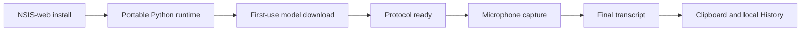

# Engineering Eve's v0.6.3 Windows baseline

## Scope and ownership

The starting point was an existing MIT-licensed desktop dictation project. The work described here did not create that original application. It took responsibility for the later Windows distribution and lifecycle-hardening path, preserved the original authorship, and shipped the resulting v0.6.3 release.

The public record is the repository's Git history, pull requests, checks, tags, and release assets. The table below maps each claim to that record.

| PR | Shipped work |
|---:|---|
| [#1](https://github.com/burntcookiedough/eve-windows-dictation/pull/1) | Prepared the portable Windows v0.6.0 release path. |
| [#2](https://github.com/burntcookiedough/eve-windows-dictation/pull/2) | Fixed packaged Python runtime validation. |
| [#3](https://github.com/burntcookiedough/eve-windows-dictation/pull/3) | Restricted release publication to intended installer artifacts. |
| [#4](https://github.com/burntcookiedough/eve-windows-dictation/pull/4) | Corrected the v0.6.1 web installer's download source. |
| [#5](https://github.com/burntcookiedough/eve-windows-dictation/pull/5) | Added model-download progress and estimated time remaining. |
| [#6](https://github.com/burntcookiedough/eve-windows-dictation/pull/6) | Prevented main-process crashes when logger streams fail with `EPIPE`. |
| [#7](https://github.com/burntcookiedough/eve-windows-dictation/pull/7) | Added a diagnostics-copy path with bounded, allowlisted output. |
| [#8](https://github.com/burntcookiedough/eve-windows-dictation/pull/8) | Contained long History text and refined microphone warnings. |
| [#9](https://github.com/burntcookiedough/eve-windows-dictation/pull/9) | Gated recording on transcription-protocol readiness. |
| [#10](https://github.com/burntcookiedough/eve-windows-dictation/pull/10) | Cancelled stale microphone startup after rapid stop/restart actions. |
| [#11](https://github.com/burntcookiedough/eve-windows-dictation/pull/11) | Synchronized, validated, and published v0.6.3. |

Repository migration work followed in [#12](https://github.com/burntcookiedough/eve-windows-dictation/pull/12), which points future release publication at the standalone repository without changing the application identity.

## The engineering problem

A desktop transcription app can work in development while failing at the boundaries that define a Windows release: finding portable Python, downloading a model, knowing when the server is ready, cancelling obsolete microphone work, surviving child-process shutdown, publishing the intended assets, and producing diagnostics without exposing dictated text.

The release-hardening work treated those boundaries as one lifecycle:

The implementation changes remained split into reviewable pull requests. Readiness became an explicit protocol state; pending microphone acquisition became cancellable; expected broken-pipe failures were contained at the logger boundary; and the release workflow verified the packaged runtime before publication.

## Release evidence

The v0.6.3 release was published from merge commit [`fbb114f`](https://github.com/burntcookiedough/eve-windows-dictation/commit/fbb114f43dc61387b3c5b513e8b476405be56ea3). GitHub records these assets:

| Asset | Exact bytes | SHA-256 |
|---|---:|---|
| `Murmur.Web.Setup.0.6.3.exe` | 887,561 | `366088a4266f54ea7c39e2e7fd1fc7177cac46bf8a4b3f43d58a6d025e15cd33` |
| `murmur-0.6.3-x64.nsis.7z` | 2,034,188,308 | `0b557fde05853da1f7c0aef77cecbad1faf8c5fc9314457ea45119d3a69f4fbd` |
| `latest.yml` | 564 | `b211cdb0322a0f6da01eee77921f6c6961735de59d4ffd8cacc31d9a3f7395a9` |

The release pipeline checks version consistency, runs the app and server test suites, smoke-starts the portable server, verifies imports before and after packaging, enforces an artifact-size safety budget, and uploads only the expected installer artifacts.

## What the evidence does not claim

- Eve is not yet the identity of the installed v0.6.3 application.
- The Windows binaries are not code-signed.
- The 2 GB payload has not yet been replaced by component downloads.
- Nemotron 3.5, Qwen3-ASR, and Srota are research candidates, not shipped profiles.
- Benchmark results in this repository are workload-specific measurements, not universal model rankings.

The measured package attribution and profile-based ASR comparison inform the [post-release roadmap](../../ROADMAP.md). They remain design work until native-Windows packaging, recovery, privacy, and repeat-start acceptance tests pass.

## Portfolio evidence still to capture

The repository history and release assets are already public evidence. A later portfolio update should add:

- a 60–90 second Windows recording showing installation, first-use model progress, Fast and Long Dictation, History, and the bounded diagnostics summary;
- screenshots after the Eve visual system is implemented, with transitional Murmur-branded screenshots labelled accurately in the meantime;
- one microphone/protocol lifecycle diagram and one release-pipeline diagram;
- benchmark tables only when the hardware, software versions, decoding settings, audio set, sample count, and measurement date accompany the result.
